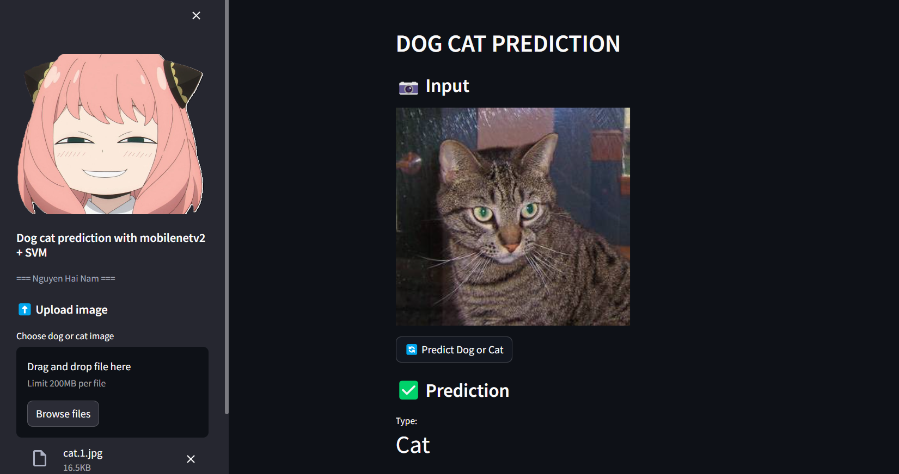

# Dog-Cat prediction with real world Images using SVM + Features extraction with MobileNetV2

## Purpose

The purpose of this project is to correctly classify dog-cat based on real world images.


## You can visit this pages to try [Dogs vs. Cats](https://dogcatdlapp-namsee.streamlit.app/)

## Project Structure

```shell
.
│   environment.yml
│   README.md
│   
├───app
│   │   app.py
│   │
│   └───img
│           anya.png
│           exp.png
│
└───src
    │   dog-cat-prediction.ipynb
    │
    └───models
            mobilenetv2_feature_extractor.h5
            pca_transformer.joblib
            SVM.joblib
```

## Project Setup

How does the Web App to **predict** Dog-Cat works?

### Clone this repository

```shell
(base)$: git clone git@github.com:mafda/knee_OA_dl_app.git
(base)$: cd DOG_CAT_DL_APP
```

### Configure environment

- Create the conda environment

    ```shell
    (base)$: conda env create -f environment.yml
    ```

- Activate the environment

    ```shell
    (base)$: conda activate Dog_Cat_app
    ```
- Run it:

    ```shell
    (knee_dl_app)$: streamlit run app/app.py
    ```

    As soon as you run the script, a local Streamlit server will spin up, and
    your app will open in a new tab in your default web browser.

    Or you can navigate to `http://localhost:8501`.


## Data preparation for training

The dataset consisting of 25000 real-world images of dog or cat
from the [Dogs vs. Cats](https://www.kaggle.com/competitions/dogs-vs-cats/data).

made with 💙 by [NamSee](https://github.com/NamSee04)
